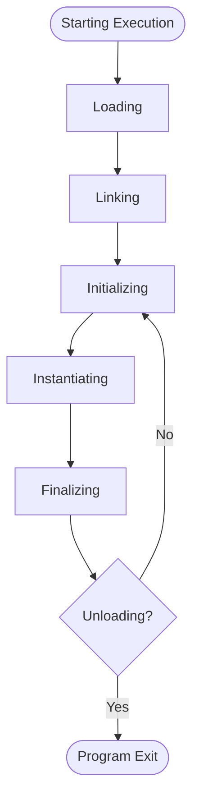

```
## Execution Lifecycle (Java Application)

1. **Compilation**  
   - `.java` → `javac` → `.class` (bytecode)

2. **Class Loading**  
   - JVM’s `ClassLoader` loads `.class` into memory, constructing `Class` objects.

3. **Bytecode Execution**  
   - JVM loads and links classes, initializes them, and executes bytecode by converting it into machine code.  
   - JVM also manages memory, threads, and exceptions.

